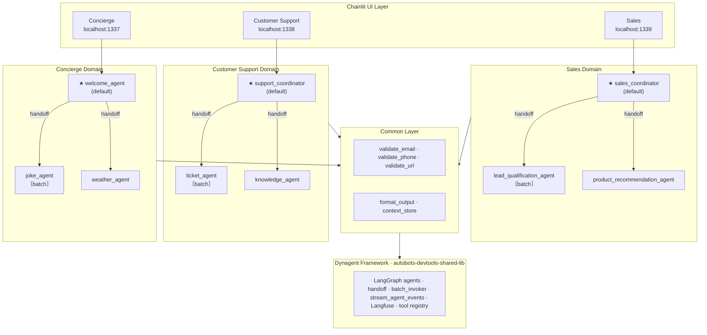

# Jarvis — Multi-Domain Multi-Agent AI Application

Jarvis is a demonstration app built on the [**Dynagent**](https://github.com/Pratishthan/autobots-devtools-shared-lib) framework. It shows how to run **multiple business domains** as separate multi-agent systems—each with its own Chainlit UI, agents, and tools—while sharing common code. You get production-style patterns: domain isolation, agent handoff, structured outputs, and batch processing, with minimal configuration.

> **Ready to build your own Jarvis-style use case?**
> Follow the **[Scaffolding guide](docs/user-manuals/scaffolding.md)** — a step-by-step walkthrough to create your own multi-domain multi-agent application.

### Multi Domain Multi Agent Architecture


> ★ = default (entry) agent &nbsp;&nbsp; 〔batch〕 = `batch_enabled: true`

### Essential features

| Feature                             | Description                                                                                                                                    |
| ----------------------------------- | ---------------------------------------------------------------------------------------------------------------------------------------------- |
| **Multi-domain architecture** | Three domains (Concierge, Customer Support, Sales) run simultaneously on different ports. Clean separation of domain-specific and shared code. |
| **Agent mesh**                | Coordinator agents route to specialists. Handoff between agents within a domain. Default agent per domain for welcome/entry.                   |
| **Structured outputs**        | JSON schemas per agent for type-safe responses. Batch-enabled agents return consistent structures.                                             |
| **Shared + domain code**      | `common/` for validation and utilities; `domains/{name}/` for server, tools, and services. Domains opt in to shared tools.                 |
| **Batch processing**          | Parallel prompt execution for qualified agents (`joke_agent`, `ticket_agent`, `lead_qualification_agent`) via `batch_invoker`.         |
| **Chainlit UI**               | Interactive chat per domain. Streaming, tool steps, and structured output out of the box.                                                      |
| **Observability**             | Langfuse integration for tracing and monitoring.                                                                                               |
| **Pythonic**                  | Pure Python and LangChain tools. Same IDE, pytest, and type hints you already use.                                                             |

## Quickstart

| Guide                                                  | Description                                                                                         |
| ------------------------------------------------------ | --------------------------------------------------------------------------------------------------- |
| **[Scaffolding](docs/user-manuals/scaffolding.md)** | Step-by-step guide to build your own Jarvis-style use case.                                         |
| **[Setup](#setup)**                                 | Prerequisites, install, and environment configuration.                                              |
| **[Run domains](#running-domains)**                 | Run all domains at once or individually. Open Concierge, Customer Support, or Sales in the browser. |

## How-to guides

| Guide                                                                   | Description                                                                                       |
| ----------------------------------------------------------------------- | ------------------------------------------------------------------------------------------------- |
| **[Setup](#setup)**                                                  | Python 3.12+, API keys, clone, install,`.env` configuration.                                    |
| **[Running domains](#running-domains)**                              | `make chainlit-all` or run Concierge (1337), Customer Support (1338), Sales (1339) separately.  |
| **[Domain descriptions](#domain-descriptions)**                      | What each domain does: agents, tools, mock data (Concierge, Customer Support, Sales).             |
| **[Shared vs domain code](#shared-vs-domain-specific-code-pattern)** | When to use `common/` vs `domains/{name}/`. Registration pattern for shared and domain tools. |
| **[Batch processing](#batch-processing)**                            | Use `batch_invoker` or domain batch helpers for joke, ticket, and lead agents.                  |
| **[Configuration](#configuration)**                                  | Agent YAML, prompts, schemas; environment variables (e.g.`DYNAGENT_CONFIG_ROOT_DIR`, API keys). |
| **[Extending Jarvis](#extending-jarvis)**                            | Add a new agent or tool; where to define config, prompts, and code.                               |

## Advanced

| Topic                                          | Description                                                                     |
| ---------------------------------------------- | ------------------------------------------------------------------------------- |
| **[Architecture](#architecture)**           | Multi-domain structure, domain pattern, agent mesh diagram.                     |
| **[Project structure](#project-structure)** | Full directory tree:`common/`, `domains/`, `agent_configs/`, tests, sbin. |
| **[Docker](#docker-support)**               | Build, run, and docker-compose targets.                                         |
| **[Troubleshooting](#troubleshooting)**     | Import errors, agent not found, missing API key.                                |
| **[Domain summary table](#domain-summary)** | Ports, default agents, batch agents, and quick access URLs.                     |

---

## Setup

**Prerequisites:** Python 3.12+, Google API Key (Gemini) or Anthropic API Key (Claude). Poetry optional.

1. **From workspace root (e.g. `ws-jarvis/`):**

   ```bash
   make install-dev   # installs into shared .venv
   ```
2. **Configure environment:**

   ```bash
   cd autobots-agents-jarvis
   cp .env.example .env
   # Edit .env: GOOGLE_API_KEY or ANTHROPIC_API_KEY
   ```

## Running domains

### Run all domains (recommended)

```bash
make chainlit-all
# or: ./sbin/run_all_domains.sh
```

Then open:

- **Concierge:** http://localhost:1337
- **Customer Support:** http://localhost:1338
- **Sales:** http://localhost:1339

Use `Ctrl+C` to stop.

### Run one domain

```bash
make chainlit-dev                 # Concierge (1337)
make chainlit-customer-support    # Customer Support (1338)
make chainlit-sales               # Sales (1339)

# Or use the scripts directly
./sbin/run_concierge.sh
./sbin/run_customer_support.sh
./sbin/run_sales.sh
```

## Architecture

### Multi-domain structure

```
autobots-agents-jarvis/
├── agent_configs/              # Per domain
│   ├── concierge/
│   ├── customer-support/
│   └── sales/
├── src/autobots_agents_jarvis/
│   ├── common/                 # Shared: tools, services, utils
│   ├── configs/
│   └── domains/                # Per domain: server, tools, services
│       ├── concierge/
│       ├── customer_support/
│       └── sales/
```

### Domain pattern

Each domain has the same layout:

```
domains/{name}/
├── server.py      # Chainlit entry
├── tools.py       # LangChain @tool wrappers
└── services.py    # Business logic
```

### Agent mesh

```
Concierge (1337)              Customer Support (1338)     Sales (1339)
┌─────────────────┐           ┌─────────────────┐          ┌─────────────────┐
│ Welcome (default)│          │ Coordinator     │          │ Coordinator     │
└────────┬────────┘           └────────┬────────┘         └────────┬────────┘
    ┌────┴────┐                    ┌────┴────┐                 ┌────┴────┐
    ▼         ▼                    ▼         ▼                 ▼         ▼
 Joke    Weather              Ticket   KB Agent           Lead     Product
 Agent   Agent                Agent                      Agent    Agent
```

## Domain descriptions

### Concierge (port 1337)

**Purpose:** General assistant (jokes, weather).
**Agents:** `welcome_agent` (default), `joke_agent` (batch), `weather_agent`.
**Tools:** `tell_joke`, `get_joke_categories`, `get_weather`, `get_forecast`.
**Mock data:** 4 joke categories, 6 cities.

### Customer Support (port 1338)

**Purpose:** Tickets and knowledge base.
**Agents:** `support_coordinator` (default), `ticket_agent` (batch), `knowledge_agent`.
**Tools:** `create_ticket`, `update_ticket`, `search_tickets`, `search_knowledge_base`, `get_article`, plus shared validators (email, phone, URL).
**Mock data:** In-memory tickets (TKT-1001+), 4 KB articles.

### Sales (port 1339)

**Purpose:** Lead qualification and product recommendations.
**Agents:** `sales_coordinator` (default), `lead_qualification_agent` (batch), `product_recommendation_agent`.
**Tools:** `qualify_lead`, `get_lead_score`, `get_product_catalog`, `recommend_products`, `check_inventory`.
**Mock data:** In-memory leads (LEAD-5001+), 6 products (3 tiers).

## Shared vs domain-specific code pattern

**Shared (`common/`):** Used by any domain (e.g. validation tools).

```python
# common/tools/validation_tools.py
@tool
def validate_email(email: str) -> str:
    """Validate email format. Available to all domains."""
```

**Domain-specific (`domains/{name}/`):** One domain only.

```python
# domains/customer_support/tools.py
@tool
def create_ticket(runtime: ToolRuntime[None, Dynagent], title: str, description: str) -> str:
    """Create support ticket. Customer Support only."""
```

**Registration in a domain server:**

```python
# domains/customer_support/server.py
from autobots_agents_jarvis.common.tools.validation_tools import register_validation_tools
from autobots_agents_jarvis.domains.customer_support.tools import register_customer_support_tools

register_validation_tools()
register_customer_support_tools()
```

## Batch processing

**Concierge — joke_agent:**

```python
from autobots_agents_jarvis.domains.concierge.concierge_batch import concierge_batch

result = concierge_batch("joke_agent", ["Tell me a programming joke", "Dad joke?"], user_id="my_user")
```

**Customer Support / Sales — framework API:**

```python
from autobots_devtools_shared_lib.dynagent import batch_invoker

result = batch_invoker("ticket_agent", ["Create ticket for login issue", "Create ticket for billing"])
result = batch_invoker("lead_qualification_agent", ["Qualify lead: Acme Corp, $100K, ..."])
```

## Configuration

**Agent config:** Per domain under `agent_configs/{domain}/` (e.g. `agents.yaml`, `prompts/`, `schemas/`). Example entry:

```yaml
agents:
  joke_agent:
    prompt: "01-joke"
    output_schema: "joke-output.json"
    batch_enabled: true
    tools:
      - "tell_joke"
      - "get_joke_categories"
      - "handoff"
      - "get_agent_list"
```

**Environment:** See `.env.example`. Key variables:

- `DYNAGENT_CONFIG_ROOT_DIR` — e.g. `agent_configs/concierge`, `agent_configs/customer-support`, `agent_configs/sales`
- `GOOGLE_API_KEY` — for Gemini
- `ANTHROPIC_API_KEY` — for Claude
- `LANGFUSE_*` — optional observability
- `OAUTH_GITHUB_CLIENT_ID`, `OAUTH_GITHUB_CLIENT_SECRET` — optional GitHub OAuth

## Extending Jarvis

### Add an agent

1. Add entry in `agent_configs/{domain}/agents.yaml`.
2. Add prompt under `agent_configs/{domain}/prompts/`.
3. Add schema (if needed) under `agent_configs/{domain}/schemas/`.
4. Implement and register tools in `domains/{domain}/tools.py`.
5. Add tests under `tests/unit/` or `tests/integration/`.

### Add a tool

```python
@tool
def my_tool(runtime: ToolRuntime[None, Dynagent], param: str) -> str:
    """Tool description for the LLM."""
    session_id = runtime.state.get("session_id", "default")
    return "Result"
# Register in that domain's register_*_tools()
```

## Development

```bash
make test
make test-fast
make test-one TEST=tests/unit/test_joke_service.py::test_get_joke_valid_category

make format
make lint
make type-check
make all-checks

make install-hooks
make pre-commit
```

## Project structure

```
autobots-agents-jarvis/
├── src/autobots_agents_jarvis/
│   ├── common/              # Shared tools, services, utils
│   ├── configs/
│   └── domains/
│       ├── concierge/       # server.py, tools.py, services.py, concierge_batch.py, settings.py
│       ├── customer_support/
│       └── sales/
├── agent_configs/
│   ├── concierge/           # agents.yaml, prompts/, schemas/
│   ├── customer-support/
│   └── sales/
├── tests/unit, integration, sanity
├── sbin/                    # run scripts
├── docs/
└── pyproject.toml
```

## Docker support

```bash
make docker-build
make docker-run
make docker-up   # docker-compose
```

## Troubleshooting

**Import errors:** Install in dev mode from workspace root: `make install-dev`.

**Agent not found:** Set `DYNAGENT_CONFIG_ROOT_DIR` to the domain config (e.g. `agent_configs/concierge`).

**Missing API key:** Set `GOOGLE_API_KEY` (or `ANTHROPIC_API_KEY`) in `.env`.

## Domain summary

| Domain           | Port | Default agent       | Batch agent              | Highlights                                  |
| ---------------- | ---- | ------------------- | ------------------------ | ------------------------------------------- |
| Concierge        | 1337 | welcome_agent       | joke_agent               | Jokes (4 categories), Weather (6 cities)    |
| Customer Support | 1338 | support_coordinator | ticket_agent             | Tickets, KB (4 articles), shared validators |
| Sales            | 1339 | sales_coordinator   | lead_qualification_agent | Lead scoring, catalog (6 products, 3 tiers) |

**Quick URLs (when running `make chainlit-all`):**
http://localhost:1337 · http://localhost:1338 · http://localhost:1339

## License

MIT

## Contributing

This repo demonstrates multi-domain multi-agent patterns. For contributions to the Dynagent framework, use the [autobots-devtools-shared-lib](https://github.com/Pratishthan/autobots-devtools-shared-lib) repository.

## Resources

- [Dynagent (autobots-devtools-shared-lib)](../autobots-devtools-shared-lib/README.md)
- [Chainlit](https://docs.chainlit.io)
- [Langfuse](https://langfuse.com)
